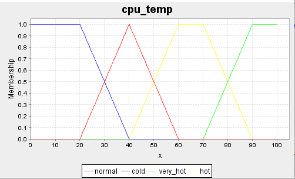
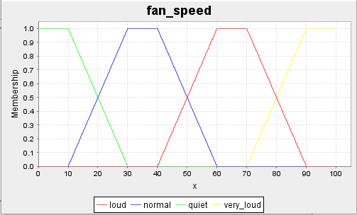
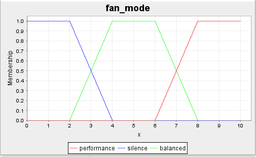
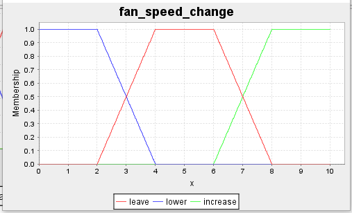
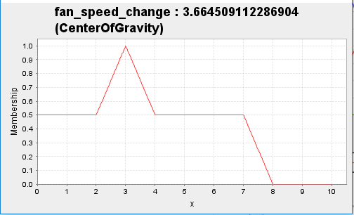
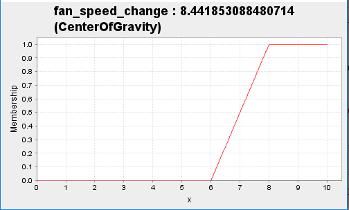

# Cpu Controller

Radomir Krawczykiewicz pt 16:15

Sprawozdanie z MSI z Zbiory rozmyte

## Opis domeny

Podczas pracy komputer może podjąć trzy akcje w sprawie działania wentylatora:

* Zwiekszyć obroty
* Pozostawić aktualne obroty
* Zmniejszyć obroty

W celu podjęcia decyzji komputer analizuję takie czyniki jak tryb pracy(cichy,
zbalansowany czy wydajnościowy) oraz temperature procesora.

## Zmiene

Nazwa - Zakres

### Wejściowe

* cpu_temp - (0, 100)



* fan_speed - (0, 100)



* fan_mode - (0, 10)



### Wyjściowe

* fan_speed_change - (0, 10)



## Reguły

Wszystkich możliwości stanów wejściowych jest: 
```
4*4*3=48
```
Jednak dzięki agregacji stanów udało się stworzyć 13 reguł,
które pokrywają 48 możliwych stanów.

Wynika to z faktu że tryby pracy performance i quiet chca odopowiednio maxium i minium.

Ponad to po zrobieniu recznie tabelki stanów zauwazyłem jak mozna uproscic reguły

## Uruchamianie

Przykładowe uruchomienie projektu
```
java -classpath lib/jFuzzyLogic_1_2_1.jar;out/production/CpuController CpuController cpu_controller.fcl 50 60 6
```



```
java -classpath lib/jFuzzyLogic_1_2_1.jar;out/production/CpuController CpuController cpu_controller.fcl 50 60 10
```



